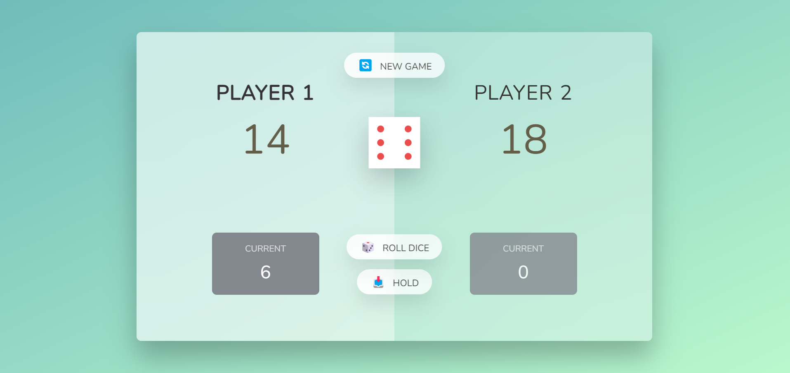

## About The Project

Two players dice game.

### Built With

- [JavaScript](https://developer.mozilla.org/en-US/docs/Web/JavaScript)
- [CSS](https://developer.mozilla.org/en-US/docs/Web/CSS)
- [HTML5](https://developer.mozilla.org/en-US/docs/Web/HTML)

## Getting Started

To start a game, open file `index.html` in the defalut browser.

## Contact

[Stefan Stamenkovic](https://www.linkedin.com/in/stefan-stamenkovic-394943254/) - cecibunkin@gmail.com

Project Link: [https://github.com/cecibunkin/Pig-Game](https://github.com/cecibunkin/Pig-Game)
